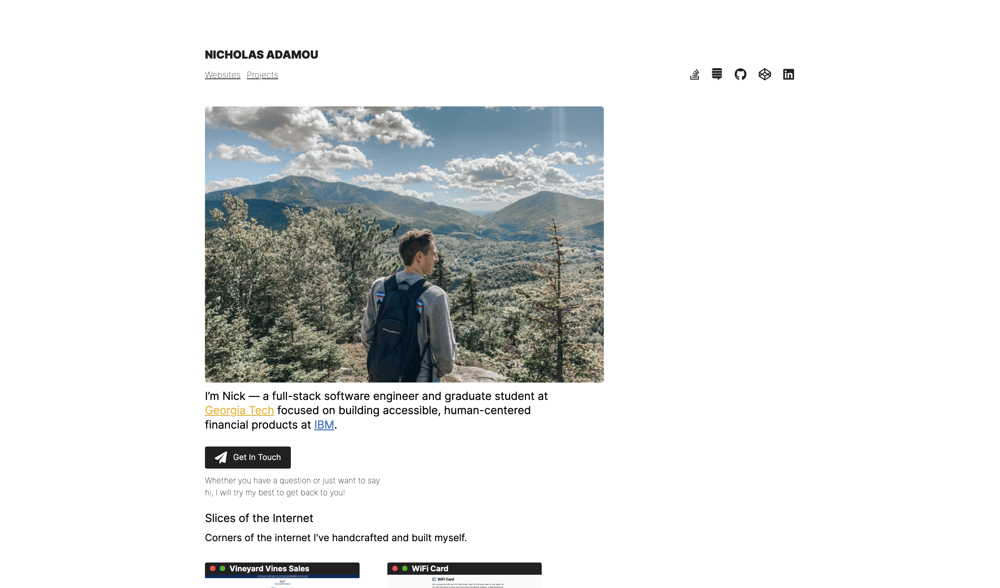

<h1 align="center">
  nicholasadamou.com - v3
</h1>
<p align="center">
  The third iteration of <a href="https://nicholasadamou.com" target="_blank">nicholasadamou.com</a> built with <a href="https://kit.svelte.dev/" target="_blank">SvelteKit</a> and hosted with <a href="https://www.netlify.com/" target="_blank">Netlify</a>.
</p>
<p align="center">
  Previous iterations:
  <a href="https://github.com/nicholasadamou/v1" target="_blank">v1</a> and
  <a href="https://github.com/nicholasadamou/v2" target="_blank">v2</a>.
</p>
<p align="center">
  <a href="https://circleci.com/gh/nicholasadamou/nicholasadamou.com" target="_blank">
    
  </a>
  <a href="https://app.netlify.com/sites/nicholasadamou/deploys" target="_blank">
    
  </a>
</p>



## 🚨 Forking this repo (please read!)

Many people have contacted me asking me if they can use this code for their own website, and the answer to that question is usually **yes, with attribution**.

I value keeping my site open source, but as you all know, _**plagiarism is bad**_. It's always disheartening whenever I find that someone has copied my site without giving me credit. I spent a non-trivial amount of effort building and designing this iteration of my website, and I am proud of it! All I ask of you all is to not claim this effort as your own.

Please also note that I did not build this site with the intention of it being a starter theme, so if you have questions about implementation, please refer to the [SvelteKit docs](https://kit.svelte.dev/docs).

### TL;DR

Yes, you can fork this repo. Please give me proper credit by linking back to [nicholasadamou.com](https://nicholasadamou.com). Thanks!

## 🛠 Installation & Set Up

### Requirements

- [Node.js](https://nodejs.org/en/)
- [Yarn](https://yarnpkg.com/en/) (recommended)

### Steps

1. Install and use the correct version of Node using [NVM](https://github.com/nvm-sh/nvm).

   ```sh
   nvm install
   ```

2. Install dependencies.

   ```sh
   yarn
   ```

3. Start the development server:

	```bash
	yarn dev

	# or start the server and open the app in a new browser tab
	yarn dev -- --open
	```

	Alternatively, you can execute the project along with the Netlify (λ) [functions](functions):

	```bash
	yarn netlify
	```

	Learn more about the *Netlify* CLI on their [documentation page](hhttps://www.netlify.com/docs/functions/).

## 🚀 Building and Running for Production

Before creating a production version of your app, install an [adapter](https://kit.svelte.dev/docs#adapters) for your target environment. Then:

```bash
yarn build
```

> You can preview the built app with `yarn preview`, regardless of whether you installed an adapter. This should _not_ be used to serve your app in production.

## 📚 The Tech. Stack

This project uses the following technologies:

**The Front-End**:

1. [**SvelteKit**](https://kit.svelte.dev/) - The fastest way to build svelte apps.
   - [**svelte-query**](https://sveltequery.vercel.app/) - Performant and powerful data synchronization for Svelte.
   - [**svelte-lazy**](https://github.com/leafOfTree/svelte-lazy) - A svelte component to lazyload any content including images.
   - [**svelte-awesome**](https://github.com/RobBrazier/svelte-awesome#more-advanced-cases) - Awesome SVG icon component for Svelte JS, built with Font Awesome icons.
   - [**svelte-loading-spinners**](https://github.com/Schum123/svelte-loading-spinners) - A collection of loading spinner components for SvelteJS.
   - [**svelte-scrollto**](https://github.com/langbamit/svelte-scrollto) - Animating vertical and horizontal scrolling.
   - [**svelte-themer**](https://github.com/josefaidt/svelte-themer) - A theming engine for your Svelte apps using CSS Variables, persisted.
   - [**svelte-google-analytics**](https://github.com/beyonk-adventures/svelte-google-analytics) - Google Analytics component for Svelte.
   - [**Moment.js**](https://momentjs.com/) - for handling dates.

## ⛓️ CI/CD Pipeline

This project uses the following CI/CD Pipeline:

1. [**CircleCI**](https://circleci.com/) - CircleCI is used to test whether or not this project builds successfully.
2. [**Netlify**](https://netlify.com/) - For continuous deployment to [_nicholasadamou.com_](https://nicholasadamou.com).

## Design 🎨

The design was developed using [**Figma**](https://www.figma.com/). It can be found at this [*shared link*](https://www.figma.com/file/WaCj0rJmmvUkky3StLTrG8/nicholasadamou.com-v3?node-id=0%3A1).

## License

© Nicholas Adamou.

It is free software, and may be redistributed under the terms specified in the [LICENSE] file.

[license]: LICENSE
